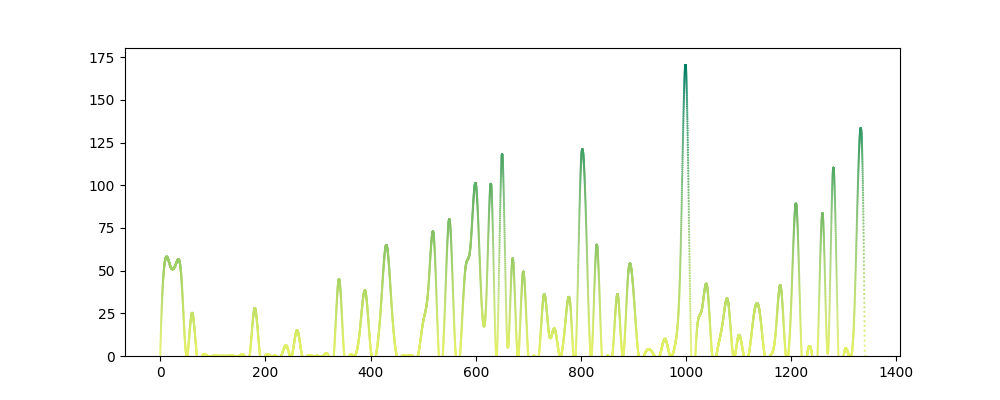

# Codeep

A GNU/Linux style toy project like the well-known sport app [Keep](http://www.gotokeep.com/). 

## Basic Functions

* A week report about your coding, such as lines, functions, classes, etc.
* Typing frequency.
* Coding style.

## How to Use
```bash 
codeep init 
```
In your working directory, type the following command to initialize Codeep before coding. Codeep will run as a daemon process to record the keystrokes frequency when you do some coding work.

The keystrokes frequency demo:

